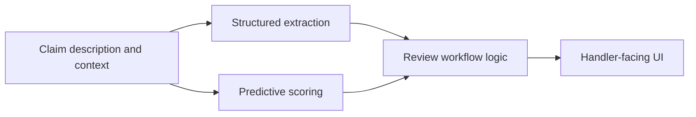
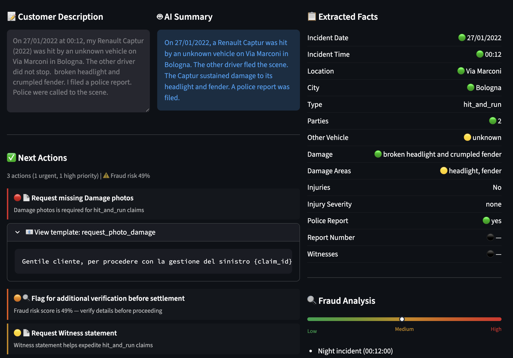
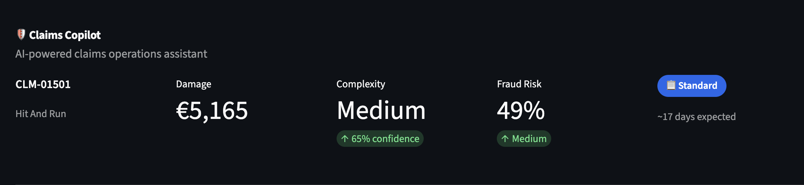
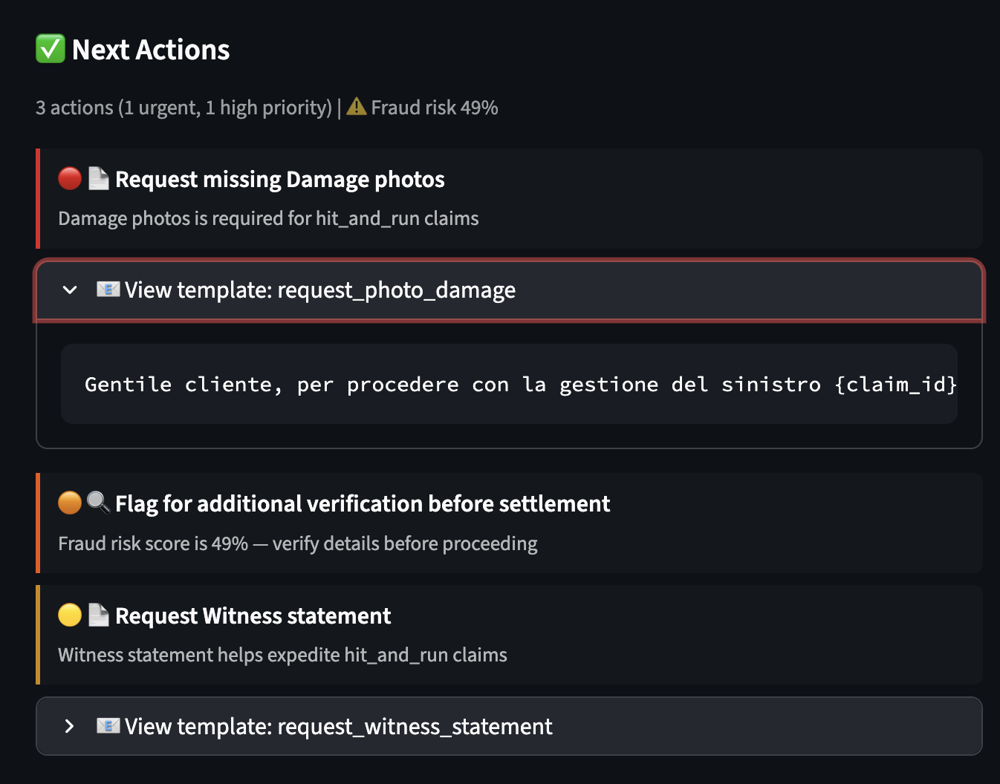

# Claims Copilot

**AI-powered claim analyzer for motor insurance intake, triage, and review workflows.**

Claims Copilot is an applied AI proof of concept built around a hard operational problem: early-stage motor insurance claim handling. The goal is not to present a generic LLM demo, but to show what an end-to-end AI workflow looks like when it has to produce structured outputs, support human review, expose uncertainty, and fit into a realistic business process.

The repository includes the PoC code, a short product demo, curated examples, and supporting documents focused on system design and evaluation.

## Demo

- Product walkthrough video: [`docs/assets/demo.mov`](docs/assets/demo.mov)
- System overview: [`docs/system-overview.md`](docs/system-overview.md)
- Sample input/output: [`docs/examples/sample-claim-input.md`](docs/examples/sample-claim-input.md), [`docs/examples/sample-claim-output.json`](docs/examples/sample-claim-output.json)

## What This Project Demonstrates

- business framing around a real operational workflow
- schema-based information extraction from noisy claim text
- human-in-the-loop review design rather than fake full automation
- evaluation discipline on synthetic claims
- explicit trade-offs around auditability, latency, and production readiness

## Problem Framing

Insurance claim intake is hard because the first customer description is often incomplete, ambiguous, and operationally risky. Useful signals are spread across free text, document presence, policy context, and downstream handling logic.

Claims Copilot treats this as a workflow problem:

1. read a free-text claim description
2. extract structured facts
3. estimate claim complexity, handling time, and fraud risk
4. recommend review-oriented next actions for a claims handler

## End-to-End Workflow



## Representative Screens

**Structured extraction and claim review**



**Complexity scores**



**Next-best-action recommendations**



## Representative Example

The repo includes a synthetic claim example based on `CLM-01501`.

Input description:

> On 27/01/2022 at 00:12, my Renault Captur (2022) was hit by an unknown vehicle on Via Marconi in Bologna. The other driver did not stop. broken headlight and crumpled fender. I filed a police report. Police were called to the scene.

Example structured output:

```json
{
  "summary": "On 27/01/2022, a Renault Captur was hit by an unknown vehicle on Via Marconi in Bologna. The other driver fled the scene. The Captur sustained damage to its headlight and fender. A police report was filed.",
  "facts": {
    "incident_date": {"value": "27/01/2022", "confidence": "high"},
    "incident_time": {"value": "00:12", "confidence": "high"},
    "incident_location": {"value": "Via Marconi", "confidence": "high"},
    "incident_city": {"value": "Bologna", "confidence": "high"},
    "incident_type": "hit_and_run",
    "damage_description": {"value": "broken headlight and crumpled fender", "confidence": "high"},
    "injuries_reported": false,
    "police_report_mentioned": {"value": "yes", "confidence": "high"}
  }
}
```

Full sample files:

- [`docs/examples/sample-claim-input.md`](docs/examples/sample-claim-input.md)
- [`docs/examples/sample-claim-output.json`](docs/examples/sample-claim-output.json)
- [`docs/examples/evaluation-summary.json`](docs/examples/evaluation-summary.json)

## Evaluation Snapshot

| Component | Metric | Result |
| --- | --- | --- |
| Extraction sample (`n=50`, local Mistral) | Incident type accuracy | `80.0%` |
| Extraction sample (`n=50`, local Mistral) | Injury detection accuracy | `94.0%` |
| Extraction sample (`n=50`, local Mistral) | Police report accuracy | `90.0%` |
| Extraction sample (`n=50`, local Mistral) | City extraction accuracy | `100.0%` |
| Complexity model | Test accuracy | `75.2%` |
| Complexity model | Validation macro F1 | `0.6597` |
| Handling time model | Test MAE | `7.12 days` |
| Fraud model | Test AUC-ROC | `0.7748` |
| Fraud model | Precision@10% review volume | `57.3%` |

These numbers come from synthetic-data experiments and should be read as proof-of-concept evidence rather than production performance claims.

## Repository Structure

- `src/api/`: FastAPI endpoints for persisted copilot outputs and handler feedback
- `src/data/`: synthetic claim generation and data utilities
- `src/extraction/`: schema-based extraction and extraction evaluation
- `src/models/`: predictive scoring features and training logic
- `src/serving/`: review workflow and next-best-action logic
- `src/ui/`: Streamlit interface for claim review
- `scripts/`: utility entrypoints for generation, extraction, and training

## Quickstart

```bash
# Install dependencies
uv sync --extra dev

# Run tests
uv run pytest -q

# Optional: train models
uv run python scripts/train_models.py --csv-dir data --model-dir models

# Run the API (requires CLAIMS_COPILOT_DSN for Postgres-backed endpoints)
uv run uvicorn src.api.app:app --reload

# Point the UI at the local API
export CLAIMS_COPILOT_API_URL="http://127.0.0.1:8000"

# Launch the UI
uv run streamlit run src/ui/app.py
```

## Technical Direction

The system is designed around a few principles:

- schema-first extraction
- structured outputs with field-level confidence where available
- review-oriented UX instead of "magic automation"
- auditable decision support
- explicit acknowledgment of limits and failure modes

More detail is in [`docs/system-overview.md`](docs/system-overview.md).

## Limitations

- this is a PoC, not a production insurance system
- evaluation is on synthetic claims, not real insurer data
- extraction quality depends on the local model and prompt setup
- production concerns like auth, monitoring, feedback loops, and service boundaries are intentionally out of scope here
- no open-source license is granted through this repository

## Usage Notice

Copyright © 2026 Davide Losio. All rights reserved.

This repository is public for viewing and evaluation. No license is granted for reuse, modification, or redistribution.
