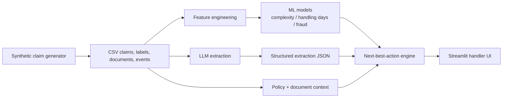

# Claims Copilot

**AI-powered claim analyzer for motor insurance intake, triage, and review workflows.**

Claims Copilot is a portfolio-grade applied AI prototype built around a hard business domain: first-notice-of-loss and early claim handling for motor insurance. The goal is not to show "an LLM demo", but to show what an end-to-end AI system looks like when it has to generate structured outputs, support human operators, expose uncertainty, and stay grounded in workflow logic.

The repo combines:

- synthetic relational claims data generation
- local LLM extraction with structured schemas
- ML models for complexity, handling time, and fraud risk
- deterministic next-best-action logic for handlers
- a Streamlit UI that turns the pipeline into a usable review surface

## What This Project Demonstrates

- framing an ambiguous business workflow as an AI product
- separating extraction, prediction, and decision layers instead of collapsing everything into one prompt
- using structured outputs and validation rather than free-form model text
- evaluating classical ML components with time-based splits
- designing for auditability and human review in a failure-prone domain

## Problem Framing

Insurance claim intake is messy:

- the first customer description is incomplete and inconsistent
- useful signals are split across free text, document presence, policy context, and historical patterns
- bad automation can create operational risk, fraud leakage, or poor customer experience

This project treats the intake problem as a workflow system:

1. parse a claim description into structured facts
2. score expected complexity, handling time, and fraud risk
3. turn those signals into review-oriented actions
4. expose the result in a handler-facing UI

## End-to-End Workflow



## Representative Example

The repo includes a checked extraction example for claim `CLM-01501`, a synthetic hit-and-run case in Bologna.

Input description:

> On 27/01/2022 at 00:12, my Renault Captur (2022) was hit by an unknown vehicle on Via Marconi in Bologna. The other driver did not stop. broken headlight and crumpled fender. I filed a police report.

Example structured output:

```json
{
  "summary": "Renault Captur hit by an unknown vehicle in Bologna; police report filed.",
  "facts": {
    "incident_type": "unknown",
    "incident_city": null,
    "damage_description": "broken headlight and crumpled fender",
    "injuries_reported": false,
    "police_report_mentioned": {
      "value": "yes",
      "confidence": "high"
    }
  },
  "missing_info": [
    {
      "field": "incident_city",
      "importance": "medium"
    },
    {
      "field": "other_vehicle",
      "importance": "high"
    }
  ]
}
```

Why this matters:

- the extraction gets some fields right and misses others
- the mismatch is visible, not hidden
- the next-best-action layer can still request missing evidence
- the system is built for human review, not blind straight-through processing

This is the kind of example that makes the project stronger in interviews: it shows system boundaries and failure handling, not fake perfection.

## Dataset Snapshot

The included synthetic dataset is intentionally product-shaped rather than notebook-shaped.

- `5,000` synthetic motor claims
- `28` incident cities
- `16.2%` synthetic fraud rate
- `15.27` average handling days
- `82.2%` document presence rate across required/recommended documents
- incident mix includes collision, theft, vandalism, weather, parking, single-vehicle, and hit-and-run cases

Current complexity distribution:

- `simple`: 2,025
- `medium`: 1,817
- `complex`: 1,158

## Evaluation Snapshot

Metrics below come from running `uv run python scripts/train_models.py --csv-dir data --model-dir models` on the included synthetic dataset.

| Component | Metric | Result |
| --- | --- | --- |
| Extraction sample (`n=50`, `mistral-nemo:12b-instruct-2407-q4_K_M`) | Incident type accuracy | `80.0%` |
| Extraction sample (`n=50`, `mistral-nemo:12b-instruct-2407-q4_K_M`) | Injury detection accuracy | `94.0%` |
| Extraction sample (`n=50`, `mistral-nemo:12b-instruct-2407-q4_K_M`) | Police report accuracy | `90.0%` |
| Extraction sample (`n=50`, `mistral-nemo:12b-instruct-2407-q4_K_M`) | City extraction accuracy | `100.0%` |
| Complexity model | Test accuracy | `75.2%` |
| Complexity model | Validation macro F1 | `0.6597` |
| Handling time model | Test MAE | `7.12 days` |
| Fraud model | Test AUC-ROC | `0.7748` |
| Fraud model | Precision@10% review volume | `57.3%` |
| Data split | Time-based | `3500 / 750 / 750` |

Raw extraction outputs for the sampled run live in [`data/extractions/extractions.json`](data/extractions/extractions.json), and the evaluation artifact lives in [`data/extractions/eval_results.json`](data/extractions/eval_results.json). The sample is still small enough that it should be read as PoC evidence rather than a stable benchmark.

## System Layers

- [`src/data/generator.py`](src/data/generator.py): builds a relational synthetic world with policyholders, policies, vehicles, claims, labels, documents, and event histories
- [`src/extraction/pipeline.py`](src/extraction/pipeline.py): local LLM extraction via Ollama with a constrained JSON schema
- [`src/models/features.py`](src/models/features.py): feature engineering aligned to what is knowable at intake time
- [`src/models/training.py`](src/models/training.py): time-based model training, evaluation, artifact loading, and prediction
- [`src/serving/next_best_action.py`](src/serving/next_best_action.py): auditable routing and action generation
- [`src/ui/app.py`](src/ui/app.py): handler-facing review UI that assembles the full workflow

## Local-First Technical Choices

- **Local LLM extraction** via Ollama keeps the demo cheap, inspectable, and easy to run without external API dependencies.
- **Structured schemas** force the extraction layer to emit machine-usable fields instead of loose summaries.
- **Time-based validation** is used for the ML models to better simulate real deployment conditions.
- **Rules for next-best-action** keep the action layer easy to audit and explain before introducing learned ranking.

## Quickstart

```bash
# Install all dependencies
uv sync --extra dev

# Generate synthetic data
uv run python scripts/generate_claims.py -n 5000

# Run tests
uv run pytest -q

# Optional: run LLM extraction on a sample (requires Ollama)
ollama serve
ollama pull mistral:7b-instruct-q4_K_M
uv run python scripts/run_extraction.py --n-sample 50 --eval

# Train models
uv run python scripts/train_models.py --csv-dir data --model-dir models

# Launch the UI
uv run streamlit run src/ui/app.py
```

## Repo Guide

- Technical architecture: [`docs/showcase-architecture.md`](docs/showcase-architecture.md)
- Recruiter / hiring-manager case study: [`docs/case-study.md`](docs/case-study.md)
- Demo recording script: [`docs/demo-script.md`](docs/demo-script.md)
- CV / LinkedIn / outreach material: [`docs/job-search-kit.md`](docs/job-search-kit.md)
- Deeper codebase study guide: [`docs/codebase-tour.md`](docs/codebase-tour.md)

## Limitations

- no service boundary yet; the UI loads artifacts directly from local files
- extraction evaluation is scaffolded, but not yet committed with a broad benchmark run
- no production auth, monitoring, feedback capture, or tracing
- next-best-action logic is deterministic v1 logic, not a learned decision policy
- synthetic data is useful for prototyping and evaluation loops, but not a substitute for real insurer operations data

## Why This Repo Exists

This project is meant to show the difference between:

- "I can call an LLM"

and

- "I can design, evaluate, and package an AI workflow around a messy operational problem"

That is the level of framing the project is optimized for.
