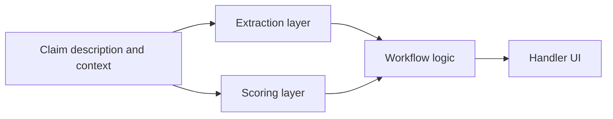

# System Overview

Claims Copilot is an AI-powered claim analysis PoC for motor insurance intake and review workflows.

This document focuses on architecture: what the main components are, how information flows between them, and where the product boundary sits.

Related docs:

- [README.md](../README.md)

## System Boundary

The system is designed to support a claims handler during early-stage claim intake.

It does not attempt full autonomous claims handling. Its role is to:

- read noisy claim input
- produce structured claim understanding
- estimate operational signals
- recommend review-oriented next actions

## High-Level Flow

## Main Components

### 1. Intake inputs

Primary inputs at claim creation time:

- free-text claim description
- policy and vehicle context
- document presence or absence

This defines the system boundary for early-stage decision support: only signals available at intake should be used.

### 2. Extraction layer

Purpose:

- convert free text into structured facts
- generate a short operator-facing summary
- expose missing information and uncertainty

Typical outputs:

- incident facts
- damage and injury fields
- police-report and witness signals
- extraction notes or missing-info flags

Architectural role:

- normalize unstructured text into workflow-usable data
- make uncertainty visible instead of burying it in prose

### 3. Scoring layer

Purpose:

- estimate claim complexity
- estimate expected handling time
- estimate fraud risk

Architectural role:

- provide quantitative signals for triage and review
- support prioritization without acting as the final decision-maker

### 4. Workflow logic

Purpose:

- combine extracted facts, model signals, and document gaps
- recommend the next operational steps

Typical outputs:

- document requests
- verification steps
- routing suggestions
- queue recommendations

Architectural role:

- translate AI outputs into operator actions
- keep the product focused on review support rather than raw model output

### 5. Handler-facing UI

Purpose:

- present the original claim input
- show structured extraction and model signals together
- surface next-best-action recommendations in one view

Architectural role:

- turn disconnected AI components into a usable workflow
- keep the human operator in control

## Component Contracts

The important contracts in the system are:

- **raw claim input -> structured extraction**
  The extraction layer should return machine-usable fields, not only a summary.

- **intake-time data -> predictive signals**
  Scoring should rely on information available at claim intake, not future outcomes.

- **structured facts + scores + document state -> operational actions**
  The workflow layer should output concrete review actions rather than generic reasoning.

These contracts matter more than the specific model choice.

## Design Choices

- **Structured extraction over free-form reasoning**
  Better fit for workflows, validation, and auditability.

- **Human-in-the-loop review over full automation**
  More credible for an operationally sensitive insurance process.

- **Separate extraction, scoring, and workflow layers**
  Easier to reason about, test, and evolve than a single monolithic AI step.

- **Product surface over isolated models**
  The value is in the assembled workflow, not just in individual predictions.

## Evaluation Hooks

The architecture supports evaluation at more than one layer:

- extraction quality on sampled synthetic claims
- predictive-model performance with time-based validation
- workflow review through concrete output examples

That is important because this is not just a "model demo". It is a system intended to behave like a product.

## Production Gaps

This PoC intentionally does not claim:

- production reliability
- live insurer integrations
- monitoring and feedback loops
- compliance completeness
- hardened service boundaries

Those are the natural next steps if the system were pushed beyond PoC stage.
